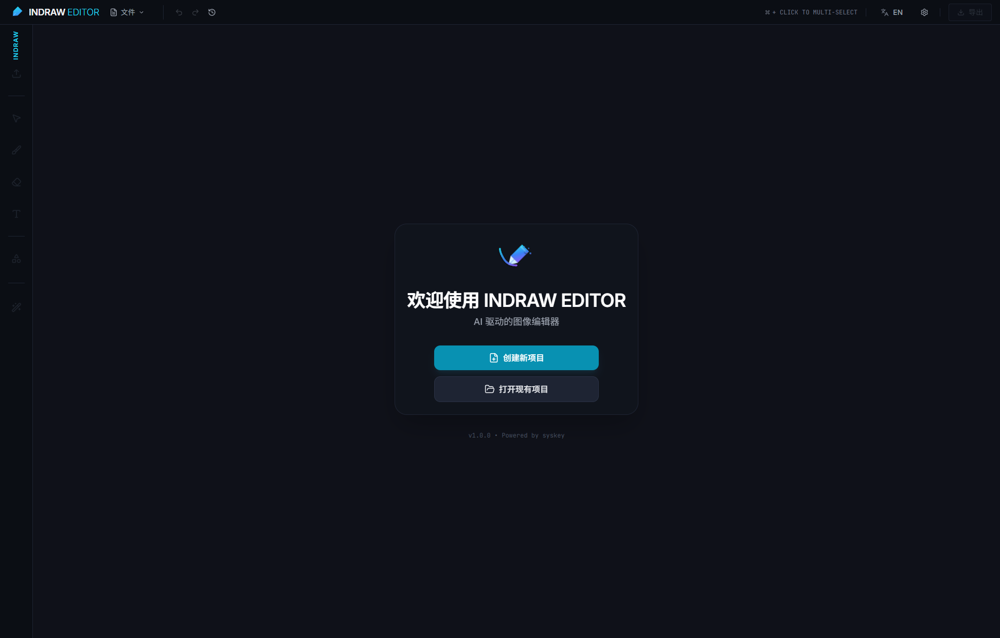

# 🎨 Indraw Editor - AI 图像编辑器

<div align="center">


> 一个充满未来感的 AI 图像编辑器，让创作变得简单又有趣 ✨




</div>

## 🌟 项目简介

嗨！欢迎来到 **Indraw Editor**！这是一个基于 AI 技术的桌面图像编辑器，专为喜欢创作但又不想被复杂工具劝退的小伙伴们设计。

想象一下，你可以：
- 🖼️ 用 AI 生成你想要的图像
- 🎨 像在 Photoshop 一样进行图层编辑
- ✏️ 用画笔自由涂鸦
- 🔷 绘制各种形状（多边形、星形、箭头...）
- 📝 添加文字和样式
- ✂️ 裁剪和合成图像
- 🔄 随时撤销重做（再也不怕手滑了！）

而且，这一切都在一个超酷的深色主题界面中进行，看起来就像未来科技产品一样！

## 🚀 核心特性

### 🤖 AI 能力
- **多 AI 提供商支持**：目前支持 Google Gemini 和 OpenAI，想用哪个用哪个！
- **AI 图像生成**：告诉 AI 你想要什么，它就能帮你画出来
- **智能图像处理**：让 AI 帮你优化和处理图像

### 🎨 编辑功能
- **图层系统**：像专业软件一样管理图层，想怎么叠就怎么叠
- **绘图工具**：
  - 画笔工具（可调节大小、颜色、透明度）
  - 橡皮擦工具
  - AI 辅助绘图模式
- **形状绘制**：多边形、星形、圆角矩形、椭圆、箭头、扇形、环形、弧形...应有尽有
- **文本编辑**：添加文字，调整样式，想怎么改就怎么改
- **图像操作**：裁剪、合成、布局调整，统统支持

### 💾 项目管理
- **项目保存/加载**：你的作品可以保存成项目文件，随时回来继续创作
- **自动保存**：忘记保存？不存在的！系统会自动帮你保存
- **图像导出**：完成的作品可以导出为图片文件

### 🌍 国际化
- 支持中文和英文界面
- 随时切换语言，想用哪个用哪个

### 🎯 用户体验
- **现代化 UI**：扁平化设计，深色主题，看着就舒服
- **历史记录**：完整的撤销/重做功能，不怕误操作
- **缩放控制**：想放大看细节？想缩小看全貌？都行！

## 🛠️ 技术栈

这个项目是用什么技术做的呢？让我来介绍一下：

### 后端（Go）
- **Wails v2**：让 Go 和前端无缝结合的框架
- **AI 服务**：
  - Google Gemini API
  - OpenAI API
- **文件服务**：处理项目保存、加载、导出等操作

### 前端（React + TypeScript）
- **React 19**：最新的 React 版本，性能杠杠的
- **TypeScript**：类型安全，写代码更放心
- **Vite**：超快的构建工具，开发体验一级棒
- **Konva**：强大的 2D 画布库，所有绘图功能都靠它
- **Tailwind CSS**：实用优先的 CSS 框架，样式写起来飞快
- **i18next**：国际化支持，多语言切换无压力

## 📦 安装与运行

### 前置要求

在开始之前，你需要准备好：

1. **Go 1.24+**：用于后端开发
2. **Node.js**：用于前端开发（建议使用 LTS 版本）
3. **npm**：Node.js 自带的包管理器

### 开发模式

想要边改代码边看效果？没问题！

```bash
# 1. 克隆项目（如果你还没有的话）
git clone <项目地址>
cd indraw

# 2. 安装前端依赖
cd frontend
npm install

# 3. 回到项目根目录，启动开发服务器
cd ..
wails dev
```

启动后，你会看到：
- 一个桌面应用窗口（这就是你的编辑器！）
- 一个浏览器开发服务器（地址通常是 http://localhost:34115）
  - 在浏览器中打开这个地址，你可以在开发者工具中直接调用 Go 代码，调试超方便！

开发模式下，前端代码修改后会自动热重载，你改完代码保存一下，界面就会自动更新，不用手动刷新！

### 构建生产版本

想要打包成可执行文件分享给别人？简单！

```bash
wails build
```

构建完成后，可执行文件会在 `build/bin/` 目录下。Windows 系统会生成 `.exe` 文件，macOS 会生成 `.app` 文件，Linux 会生成可执行文件。

## 📁 项目结构

让我来介绍一下项目的文件结构，这样你就能快速找到需要的代码：

```
indraw/
├── core/                    # Go 后端核心代码
│   ├── app.go              # 应用主入口
│   ├── provider/           # AI 提供商实现
│   │   ├── ai_provider.go  # AI 提供商接口
│   │   ├── gemini_provider.go  # Gemini 实现
│   │   └── openai_provider.go  # OpenAI 实现
│   ├── service/            # 业务服务层
│   │   ├── ai_service.go   # AI 服务管理
│   │   ├── config_service.go  # 配置管理
│   │   └── file_service.go    # 文件操作服务
│   └── types/              # 类型定义
│       └── types.go
├── frontend/               # React 前端代码
│   ├── src/
│   │   ├── components/     # React 组件
│   │   │   ├── CanvasBoard.tsx      # 画布主组件
│   │   │   ├── Toolbar.tsx          # 工具栏
│   │   │   ├── PropertiesPanel.tsx  # 属性面板
│   │   │   ├── HistoryPanel.tsx     # 历史记录面板
│   │   │   └── ...                  # 其他组件
│   │   ├── hooks/         # React Hooks
│   │   │   ├── useHistory.ts        # 历史记录管理
│   │   │   ├── useLayerManager.ts   # 图层管理
│   │   │   └── ...
│   │   ├── services/      # 前端服务
│   │   │   ├── aiService.ts         # AI 服务调用
│   │   │   └── ...
│   │   ├── utils/         # 工具函数
│   │   ├── locales/       # 国际化文件
│   │   └── types/         # TypeScript 类型定义
│   ├── package.json        # 前端依赖配置
│   └── vite.config.ts      # Vite 配置
├── build/                  # 构建输出目录
├── main.go                 # Go 程序入口
├── go.mod                  # Go 依赖管理
├── wails.json              # Wails 项目配置
└── README.md               # 本文件
```

## 🎮 使用指南

### 首次使用

1. **创建新项目**：启动应用后，点击"创建新项目"按钮
2. **配置 AI**：在设置面板中配置你的 AI API 密钥
   - Gemini API Key：从 Google AI Studio 获取
   - OpenAI API Key：从 OpenAI 官网获取
3. **开始创作**：选择工具，开始你的创作之旅！

### 基本操作

- **选择工具**：点击工具栏中的工具图标
- **绘制图形**：在画布上点击并拖拽
- **编辑图层**：点击图层列表中的图层，在属性面板中调整
- **撤销/重做**：使用历史记录面板或快捷键（通常是 Ctrl+Z / Ctrl+Y）
- **保存项目**：文件菜单 → 保存项目
- **导出图像**：文件菜单 → 导出图像

### 快捷键

Indraw Editor 支持丰富的键盘快捷键，让你操作更高效！💨

#### 📝 编辑操作
- **`Ctrl/Cmd + Z`** - 撤销上一步操作（手滑了？别怕！）
- **`Ctrl/Cmd + Shift + Z`** - 重做（撤销错了？再撤销回来！）
- **`Ctrl/Cmd + S`** - 快速保存项目（养成好习惯，经常保存！）

#### 📋 图层操作
- **`Ctrl/Cmd + C`** - 复制选中的图层
- **`Ctrl/Cmd + V`** - 粘贴图层
- **`Delete` 或 `Backspace`** - 删除选中的图层（小心使用哦～）
- **`Ctrl/Cmd + G`** - 组合选中的图层（把它们打包在一起）
- **`Ctrl/Cmd + Shift + G`** - 取消组合（拆包啦）

#### 🎯 选择操作
- **`Shift + 点击`** - 多选图层（按住 Shift 键，点击多个图层）
- **`Ctrl/Cmd + 点击`** - 多选图层（Mac 用户用 Cmd，Windows 用户用 Ctrl）
- **`Esc`** - 取消选择 / 退出画笔模式（想取消操作？按它！）

> 💡 **小贴士**：在输入框或文本编辑时，部分快捷键会被禁用，避免误操作。是不是很贴心？😊

## 🔧 配置说明

### AI 提供商配置

在设置面板中可以配置 AI 提供商：

- **Gemini**：需要 Google AI Studio API Key
- **OpenAI**：需要 OpenAI API Key

配置会保存在本地，下次启动时会自动加载。

### 项目配置

项目配置文件位于 `wails.json`，可以修改：
- 应用名称
- 窗口大小
- 构建选项等

更多配置选项请参考 [Wails 官方文档](https://wails.io/docs/reference/project-config)

## 🤝 贡献指南

欢迎贡献代码！如果你发现 bug 或者有好的想法，随时可以：

1. Fork 这个项目
2. 创建你的特性分支 (`git checkout -b feature/AmazingFeature`)
3. 提交你的更改 (`git commit -m 'Add some AmazingFeature'`)
4. 推送到分支 (`git push origin feature/AmazingFeature`)
5. 开启一个 Pull Request

## 📝 开发注意事项

### 前端开发

- 使用 TypeScript 编写代码，保持类型安全
- 组件使用函数式组件 + Hooks
- 样式使用 Tailwind CSS，保持一致性
- 国际化文本放在 `locales` 目录下

### 后端开发

- Go 代码遵循 Go 代码规范
- 服务层负责业务逻辑
- 提供商模式让 AI 服务易于扩展

### 调试技巧

- 开发模式下，可以在浏览器控制台调用 Go 方法
- 使用 React DevTools 调试前端组件
- 使用 Go 的日志输出调试后端逻辑

## 🐛 已知问题

- 偶尔会出现卡顿 慢慢优化呀

## 📄 许可证

本项目采用 MIT 许可证。

## 🙏 致谢

感谢以下开源项目：
- [Wails](https://wails.io/) - 让 Go 和前端结合的框架
- [React](https://react.dev/) - 强大的 UI 库
- [Konva](https://konvajs.org/) - 2D 画布库
- [Tailwind CSS](https://tailwindcss.com/) - 实用优先的 CSS 框架
- 以及所有其他依赖的开源项目

## 📮 联系方式

- 作者：syskey
- 邮箱：syskeykala@gmail.com

---

**最后的话**：这个项目还在不断完善中，如果你有任何建议或问题，欢迎随时反馈！让我们一起把这个编辑器做得更好用、更强大！💪

Happy Coding! 🎉
